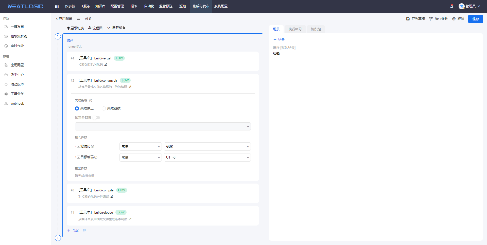
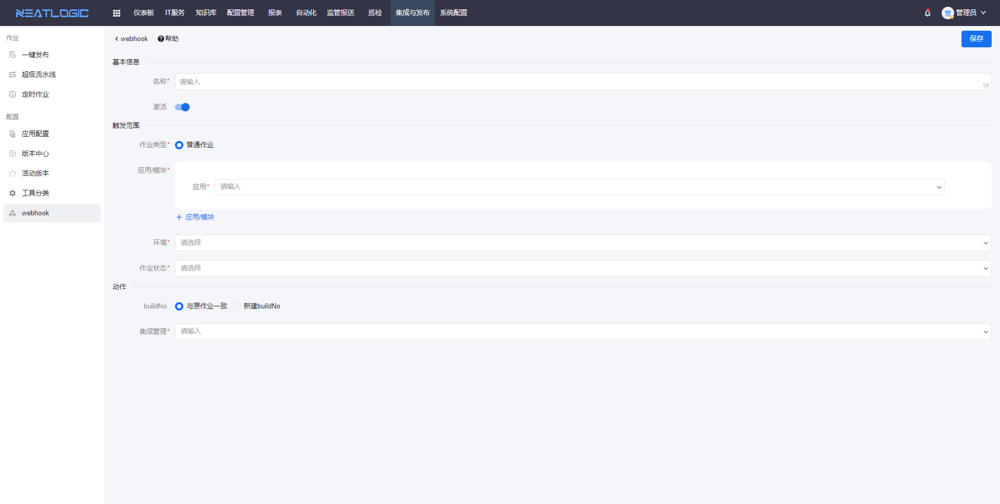

[Chinese](README.md) / English

## about

Neatlogic deploy is a publishing module that can solve the scenario of one click publishing in application environments, mainly including application configuration, version center, one click publishing, and other functions.

## Feature

### Application Configuration

Application configuration mainly manages the configuration of pipeline scripts and parameters for application, module layer, and environment layer.

- Support configuration application continuous integration.
- Support the configuration of application super pipelines, and only the current application can be selected in the template.
- Support for configuring notification policies.
- Support managing user scope through authorization.
- Support for editing application, module, and environmental information

### Version Center

The version center is used to manage the versions and engineering materials of application modules. The compiled version of the engineering physics library supports uploading and downloading.

### One-click publishing

One-click publishing page supports launching single publishing jobs and launching batch jobs.
1. Initiate a single publish job 
Select the application and module that initiated the job (with a configured assembly line and environment), and then click the Add Job button to complete the configuration of initiating and publishing the job and save it.

2. Batch Publish Job 
Batch publishing jobs can be created directly or initiated through a super assembly line. Direct creation refers to adding existing jobs to a collection, and the super pipeline method is initiated through templates.

### Superpipeline

The Superpipeline manages global batch publishing job templates, and supports the initiation of batch jobs and scheduled jobs.

### Scheduled job
Scheduled job are initiated and published by configuring a fixed job timer, which supports two types of jobs: regular jobs and super pipeline jobs.

 ### Webhook
 The webhook page is used to manage job triggers, including configuring trigger ranges and trigger actions. The trigger range is the trigger point, and the object of the trigger range is the job state associated with the application module's environment. The trigger action is an integrated configuration associated with the "Publish Trigger Data Specification" type.
 