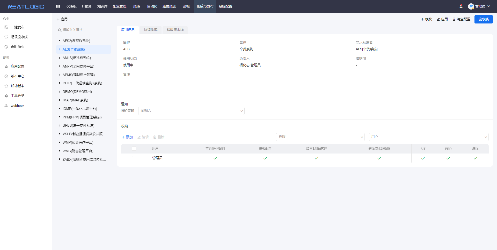

中文 / [English](README.en.md)

    

---

## 关于

neatlogic-deploy是发布模块，可以解决应用环境一键发布的场景，主要包括应用配置、版本中心、一键发布等功能。
neatlogic-deploy需要自动化模块[neatlogic-autoexec](../../../neatlogic-autoexec/blob/develop3.0.0/README.md)提供支持。

## 主要功能

### 应用配置

应用配置主要是管理应用、模块层和环境层的流水线脚本和参数等配置。

- 支持配置应用持续集成
- 支持配置应用超级流水线，模板中只能选当前应用。
- 支持配置通知策略
- 支持通过授权管理使用者范围
- 支持编辑应用、模块和环境信息

### 版本中心

版本中心是用于管理应用模块的版本及版本的工程物料。已编译过的版本的工程物理库支持上传和下载

### 一键发布

一键发布页面支持发起单个发布作业和发起批量作业

1. 发起单个发布作业 
   选择发起作业的应用、模块（已配置流水线和环境），然后点击添加作业按钮，完成发起发布作业配置并保存
   
   
2. 批量发布作业 
   批量发布作业可以直接创建也可以通过超级流水线发起。直接创建是将当前已有作业添加到一个集合里，超级流水线方式是通过模板发起。
   
   
   

### 超级流水线

超级流水线是管理全局批量发布作业模板，超级流水线支持发起批量作业和发起定时作业。

### 定时作业

定时作业通过配置固定作业定时器实现定时发起发布作业，发起的作业类型支持普通作业和超级流水线两种。

### Webhook

webhook页面是管理作业触发器，包括配置触发范围和触发动作，触发范围即触发点，触发范围的对象是应用模块的环境关联的作业状态，触发动作则是关联“发布触发器数据规范”类型的集成配置。

## 功能列表

<table border="1"><tr><td>编号</td><td>分类</td><td>功能点</td><td>说明</td></tr><tr><td>1</td><td rowspan="5">参数</td><td rowspan="2">全局参数</td><td>支持自动化作业全局参数的增删改查基础管理。</td></tr><tr><td>2</td><td>支持全局参数字段文本、密码、日期、文本域等类型。</td></tr><tr><td>3</td><td rowspan="3">预设参数</td><td>支持自动化作业预设参数的增删改查基础管理。</td></tr><tr><td>4</td><td>支持按工具库、原子操作预设参数集。</td></tr><tr><td>5</td><td>支持预设参数集引用全局参数。</td></tr><tr><td>6</td><td rowspan="5">分类</td><td rowspan="3">工具分类</td><td>支持工具分类的增删改查基础管理。</td></tr><tr><td>7</td><td>支持工具库查看统计分类下面的工具库、自定义原子操作、关联编排的数量。</td></tr><tr><td>8</td><td>支持工具库按类型设置工具库的权限。</td></tr><tr><td>9</td><td rowspan="2">工具目录</td><td>支持工具目录的增删改查基础管理。</td></tr><tr><td>10</td><td>支持工具库按目录设置权限。</td></tr><tr><td>11</td><td rowspan="3">场景</td><td rowspan="3">编排场景</td><td>支持自动化场景的增删改查基础管理。</td></tr><tr><td>12</td><td>支持按类型、按场景、按岗位职能定义自动化场景分类。</td></tr><tr><td>13</td><td>支持在自动化的组合编排内，设置不同的使用场景，不同的使用场景包含了编排中的不同执行阶段。场景可以实现一个编排，多种使用场景的需求。</td></tr><tr><td>14</td><td rowspan="15">工具库</td><td rowspan="4">内置工具库</td><td>平台内置常用的基础工具库外，还包括发布模块的文件操作、配置备份、SQL执行、服务启停、WebSphere发布插件、K8s发布插件、Docker发布插件、WebLogic发布插件等。</td></tr><tr><td>15</td><td>支持内置工具在线测试。</td></tr><tr><td>16</td><td>支持内置工具库在线帮助，如输入参数、输出参数、执行方式、风险等级。</td></tr><tr><td>17</td><td>支持内置工具库关联自定义展示模板。</td></tr><tr><td>18</td><td rowspan="11">自定义      原子操作</td><td>支持常见的脚本语言，包括Python、Ruby、VBScript、Perl、PowerShell、CMD、Bash、csh、ksh、sh、JavaScript。</td></tr><tr><td>19</td><td>支持丰富的输入、输出参数类型，包括文本、文本域、密码、文件、时间、日期、单选、多选、开关、账号、JSON对象、节点信息，参数支持设置默认值。</td></tr><tr><td>20</td><td>支持命令行参数,可指定或不指定命令行参数数量。</td></tr><tr><td>21</td><td>支持自定义工具可设置风险等级。</td></tr><tr><td>22</td><td>支持自定义工具可绑定工具目录。</td></tr><tr><td>23</td><td>支持基于git版本管理，支持基于从git导入、导出原子操作。</td></tr><tr><td>24</td><td>支持自定义工具支持版本审核发布。</td></tr><tr><td>25</td><td>支持常见的连接协议，如：SSH、WinRM、Tagent、IPMI、HTTP、HTTPS、Telnet、SNMP、SMI等。</td></tr><tr><td>26</td><td>支持连接方式，如：远端目标机器执行、本地执行、本地到远程执行。</td></tr><tr><td>27</td><td>支持自定义原子操作在线测试验证。</td></tr><tr><td>28</td><td>支持远在操作导入、导出，用于在不同环境的环境迁移。</td></tr><tr><td>29</td><td rowspan="35">发布管理</td><td rowspan="2">发布模板</td><td>支持按类型定义一类的发布场景模板，如WebLogic发布，预定义一类发布模板，单独实例配置时选择对应的模板快速完成发布配置。</td></tr><tr><td>30</td><td>支持常规发布的单实例、集群部署的模板配置，如WebLogic应用更新。</td></tr><tr><td>31</td><td rowspan="9">发布配置</td><td>支持发布模板组合管理的增删改查基础管理功能。</td></tr><tr><td>32</td><td>支持自定义场景发布编排组合，支持图形化拖拉拽布局设计。</td></tr><tr><td>33</td><td>支持复制现有发布组合编排，用于创建与原组合编排相似的新组合编排。</td></tr><tr><td>34</td><td>支持发布组合编排内工具自定义若干阶段或阶段组，阶段内的工具支持串行、并行、条件判断。</td></tr><tr><td>35</td><td>支持发布组合编排阶段内工具全量、分批次、灰度等执行策略。</td></tr><tr><td>36</td><td>支持基础剧本的新增、编辑、删除管理功能，基础剧本可进行可见层级授权，即剧本可设置被调用的层级，包括在子系统层级可见、环境层级可见与实例层级可见。</td></tr><tr><td>37</td><td>编排剧本内可支持对编排工具库和自定义原则操作的直接调用，简化剧本的设计过程。</td></tr><tr><td>38</td><td>支持子系统、系统环境、发布实例下的剧本(Playbook)编排，可对多个剧本进行编排，快速执行剧本的增删改等操作。</td></tr><tr><td>39</td><td>相同剧本在不同层级管理单元之间可继承、重用，且优先级从高到低的顺序为：应用实例层级、子系统环境层级、子系统层级。</td></tr><tr><td>40</td><td>场景预设</td><td>支持一个系统内的发布按场景进行预选设置，比如：只编译、构建、备份、回退、SQL执行、应用启停等。</td></tr><tr><td>41</td><td rowspan="7">编译&amp;构建</td><td>支持从SVN、Git代码仓库开始的应用代码自动化编译打包与自动发布，同时支持从SVN获取数据库脚本、应用配置文件的自动化执行与下发功能。</td></tr><tr><td>42</td><td>支持代码基线自动维护，发布后自动归并修改到基线，编译前自动归并基线上的修改到发布分支。</td></tr><tr><td>43</td><td>支持对JUnit的测试结果数据进行抽取和展示。</td></tr><tr><td>44</td><td>支持对接SonarQube代码扫描，并且出具扫表结果清单。</td></tr><tr><td>45</td><td>具有封版的功能，封版后，需要有权限的用户开版后才能再编译，防止在生产发布前代码存在修改而没有经过测试。</td></tr><tr><td>46</td><td>支持通过Maven、Ant、Gradle等工具自动化编译打包Java应用；支持.Net、C、VC++、Java等应用的自动化编译打包；同时支持自定义编译打包脚本设计功能，以完成应用的自定义编译打包。</td></tr><tr><td>47</td><td>对于编译完成后的应用，平台支持根据自定义需要进行物料整理，并将整理后的物料重新完成自动化打包。</td></tr><tr><td>48</td><td rowspan="2">配置      修改/替换</td><td>支持应用配置文件的自动化部署功能，支持配置文件的自动化修改、自动替换。</td></tr><tr><td>49</td><td>支持服务器差异配置的自动配置，支持配置模版功能，配置模版和环境配置结合，生成可以适配到不同的环境(例如：SIT、UAT、PRD)的最终配置文件。</td></tr><tr><td>50</td><td rowspan="6">数据库脚本      自动执行</td><td>依据一定的规则，对DB脚本自动识别运行目标和运行顺序串行或并行运行，出错可以交互选择提交或回退。操作可重入，执行成功的脚本不会再执行，能够自动识别修改过的DB脚本并进行提示；自带数据库链接插件，支持MySql、PosgreSQL、Oracle、DB2的发布；DB脚本使用MySql   client，Oracle SQLPlus，db2cli兼容的运行方式，能够在上述工具中运行的DB脚本能够直接在发布工具中执行。</td></tr><tr><td>51</td><td>数据库脚本执行出错时，平台页面支持用户交互，用户可选择提交或者回滚；支持数据库事务rollback/commit实时回显时，支持对关键字及所在行作颜色标记。</td></tr><tr><td>52</td><td>支持多DB脚本的免输入以及免说明的一键发布；支持选择并执行若干个DB脚本</td></tr><tr><td>53</td><td>数据库脚本操作可重入，执行成功的脚本不会重复执行，平台能够自动识别修改过的数据库脚本并给出提示。</td></tr><tr><td>54</td><td>支持数据库脚本的回退功能，明确列出回退脚本列表，用户可以交互式的进行回退操作。并且脚本回退操作可重入，执行成功的脚本不能重复执行。</td></tr><tr><td>55</td><td>针对Oracle数据库，进行失效对象的检查和重新编译处理。</td></tr><tr><td>56</td><td rowspan="8">部署&amp;发布</td><td>支持Linux、Unix、Windows等系统上的的应用自动化部署。</td></tr><tr><td>57</td><td>支持自带部署插件,包含Tomcat、WebLogic和WAS的部署插件，并且支持扩展。</td></tr><tr><td>58</td><td>支持应用批量一键发布功能，即一次发布多个系统版本，应用系统之间需考虑发布优先级。在发布过程中，能够对批量发布中的作业进行暂停、重新运行等操作，以及能够对已修复的作业进行重新发布；</td></tr><tr><td>59</td><td>单个应用的自动化发布与多个应用的一键发布，均需实时显示各个发布过程的状态；</td></tr><tr><td>60</td><td>支持应用版本回退，平台可快速的选择历史任一版本进行回退操作；</td></tr><tr><td>61</td><td>支持应用实例的状态监控，版本发布完成后，平台能够方便的检测与查看应用实例的健康状态。</td></tr><tr><td>62</td><td>支持应用重启操作，可以选择应用的多个实例进行并行或串行的启动与停止操作，且能够提供独立的授权管理功能，可授权给指定用户，便于用户能够自动化部署平台重启应用并查看日志。</td></tr><tr><td>63</td><td>支持待发布物料的完备性、版本一致性等校验，支持数据库脚本的自动扫描。</td></tr><tr><td>64</td><td rowspan="4">代码管理</td><td rowspan="4">代码管理</td><td>支持编译前检查版本分支（集成分支）是否已经合并代码基线（master）的更改。</td></tr><tr><td>65</td><td>支持生产发布并通过验证后，自动触发将对应版本的代码合并回基线（master）。</td></tr><tr><td>66</td><td>支持通过设置Git或者SVN钩子触发版本的自动编译以及SIT环境的自动发布，并能够看到此次编译对应的代码修改的相关描述。</td></tr><tr><td>67</td><td>支持对代码分支自动打标签。</td></tr><tr><td>68</td><td rowspan="4">版本中心</td><td rowspan="2">制品管理</td><td>支持内置应用版本制品管理，生产能够从自身制品中获取版本。</td></tr><tr><td>69</td><td>支持对接nexus等第三方版本制品库。</td></tr><tr><td>70</td><td rowspan="2">版本管理</td><td>支持对发布过的版本代码、SQL、配置文件进行归档。</td></tr><tr><td>71</td><td>支持版本定义、版本开/封版本操作。</td></tr><tr><td>72</td><td rowspan="17">版本发布</td><td rowspan="6">批量发布</td><td>支持基于发布流水线、发布作业进行批量发布编排定义。</td></tr><tr><td>73</td><td>支持多个作业批量执行，在同一批量作业内，可依据应用间逻辑关系进行多个发布作业的串行或并行编排。用户只需一个按钮即可完成整个多个作业的批量执行。</td></tr><tr><td>74</td><td>支持批量发布中的发布任务串行、并行泳道定义和配置。</td></tr><tr><td>75</td><td>支持批量发布中发布任务状态策略，如失败了继续、等待策略等。</td></tr><tr><td>76</td><td></td></tr><tr><td>77</td><td>支持批量发布权限配置。</td></tr><tr><td>78</td><td rowspan="11">一键发布</td><td>支持以应用角度查看发布列表，支持快速搜索功能，通过搜索快速查找应用系统或模块的配置。</td></tr><tr><td>79</td><td>支持发布回退。</td></tr><tr><td>80</td><td>支持按场景或全量发布配置方式执行。</td></tr><tr><td>81</td><td>可以选择性的执行现有的自动部署流程中的部分步骤。</td></tr><tr><td>82</td><td>支持基于应用的服务器实例进行多个操作剧本的外循环运行，可以在外循环某一个循环中执行DB脚本。</td></tr><tr><td>83</td><td>支持作业任务的定时执行，平台支持定期与按周期执行作业，按照设定的触发规则自动创建与运行作业，便于测试环境的自动发布。</td></tr><tr><td>84</td><td>支持应用日志的查看功能，用户能够在自动化部署平台内实时查看与下载应用日志文件。</td></tr><tr><td>85</td><td>支持白盒发布功能，即发布过程中每一个动作，系统均需能够实时滚动式的展示运行日志。</td></tr><tr><td>86</td><td>支持查看发布过程操作日志记录，每一个发布步骤均需有日志信息，记录信息包括但不限于以下内容：操作人、操作时间与操作耗时等；并且操作日志可导出，以供审查。</td></tr><tr><td>87</td><td>支持发布日志实时滚动打印，对于异步启动的应用，能够实时tail日志一直到应用启动完成。</td></tr><tr><td>88</td><td>所有实时显示的状态日志，需以不同颜色区分错误信息、告警信息与正常信息等，方便用户识别。</td></tr></table>